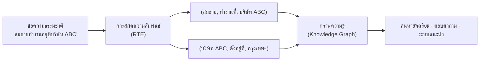
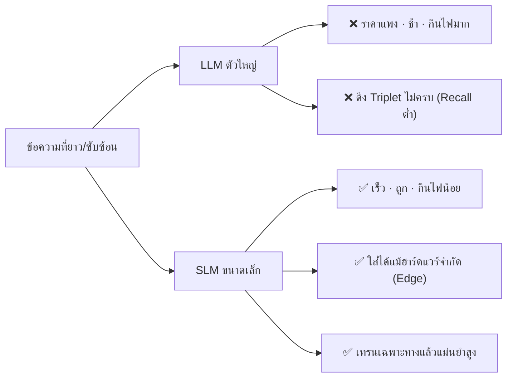
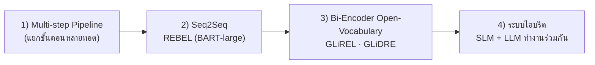
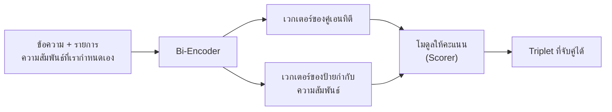
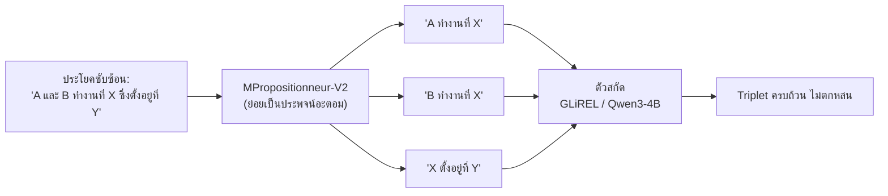
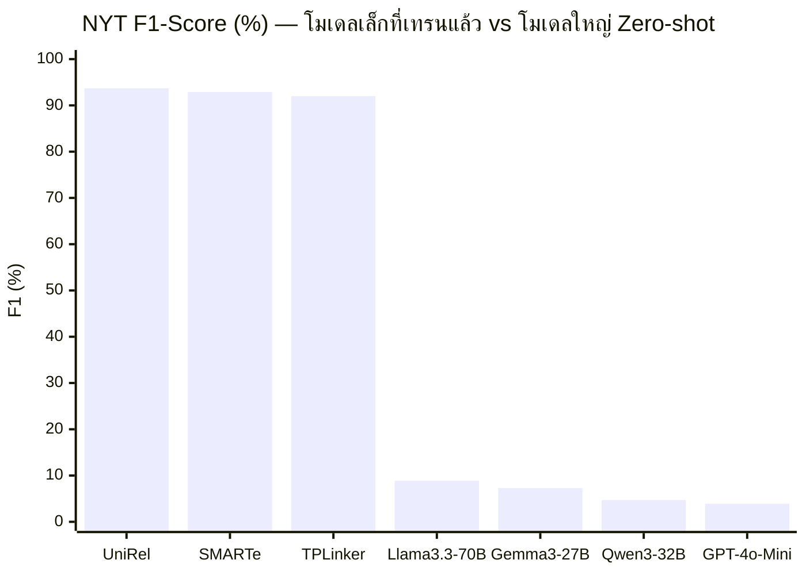
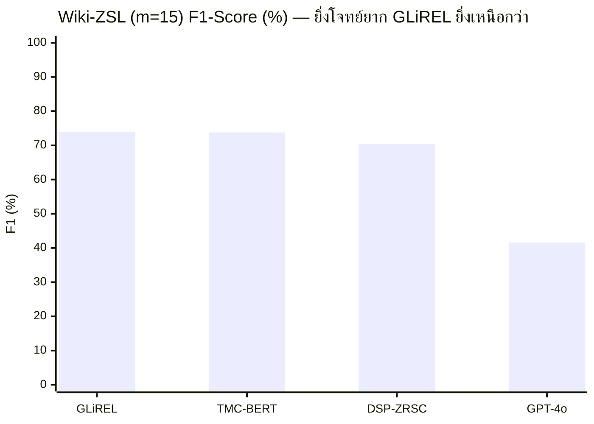
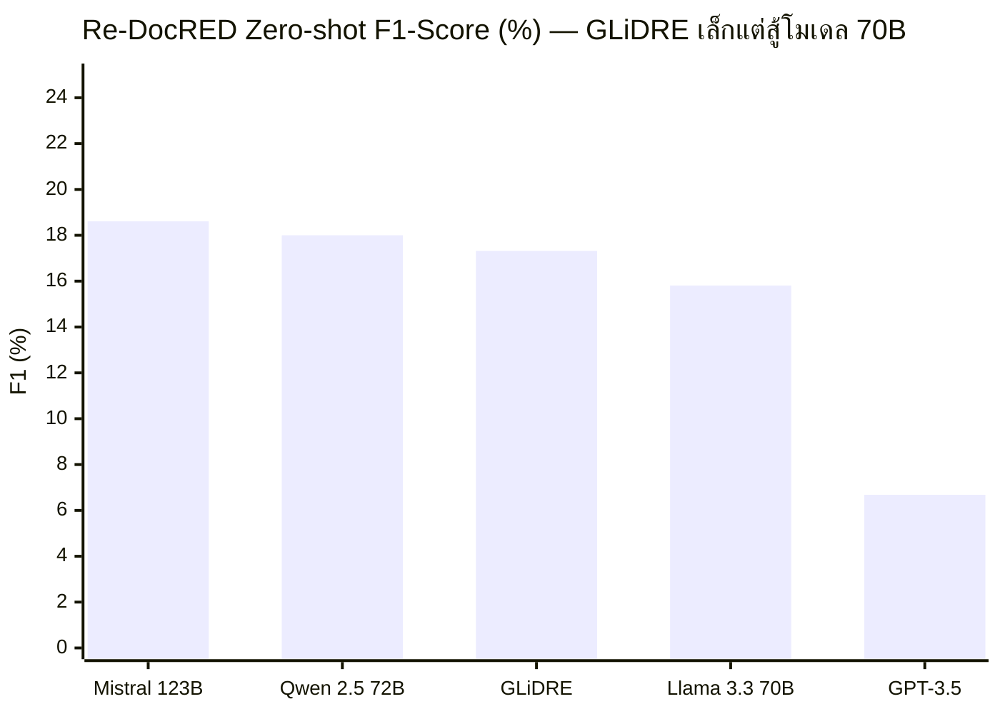
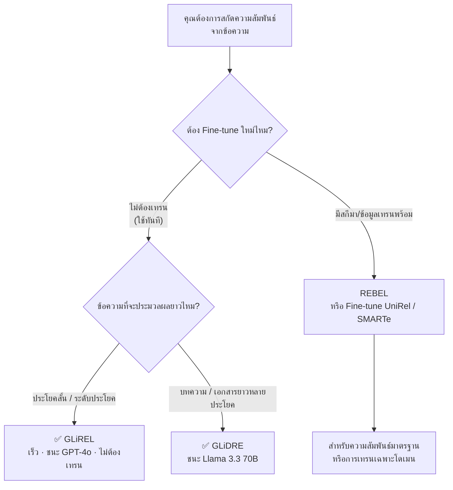

# การสกัดความสัมพันธ์เชิงสามส่วนด้วย SLM
### คู่มือเลือกโมเดล ฉบับอ่านเข้าใจง่าย พร้อมแผนภาพ (เรียบเรียงจากรายงานต้นฉบับ)

---

## ⚡ TL;DR — สรุปแบบอ่านจบใน 10 วินาที

| คำถาม | คำตอบ |
| :--- | :--- |
| **งานนี้คืออะไร** | เปลี่ยนข้อความภาษาธรรมชาติให้เป็นข้อมูล 3 ส่วน `(ประธาน, ความสัมพันธ์, กรรม)` เพื่อนำไปสร้างกราฟความรู้ |
| **ปัญหาคืออะไร** | โมเดลใหญ่ (LLM) ราคาแพง ช้า กินพลังงาน และ**ดึงข้อมูลได้ไม่ครบ**เมื่อเจอข้อความซับซ้อน |
| **ทางออกคืออะไร** | โมเดลขนาดเล็ก (SLM) — เร็วกว่า ถูกกว่า และเมื่อ Fine-tune เฉพาะทางแล้ว**แม่นยำกว่า LLM แบบ Zero-shot อย่างมาก** |
| **ตัวเลือกที่แนะนำ** | **GLiREL** (ประโยคสั้น, ไม่ต้องเทรน) · **GLiDRE** (เอกสารยาว) · **REBEL** (ความสัมพันธ์มาตรฐาน, เทรนต่อได้) |

---

## บทที่ 1 · งานนี้คืออะไร และทำไมถึงสำคัญ

### 1.1 Triplet คืออะไร? ฟังง่ายๆ ก็แค่ "ใคร ทำอะไร กับใคร"

สมมติเรามีประโยค:

> "สมชายทำงานอยู่ที่บริษัท ABC"

เราสามารถแยกออกมาเป็นข้อมูล 3 ส่วน (Triplet) ได้ว่า:

```
(สมชาย, ทำงานที่, บริษัท ABC)
   │       │           │
  Subject  Relation   Object
 (ประธาน) (ความสัมพันธ์) (กรรม)
```

เมื่อรวบรวม Triplet หลายๆ อันเข้าด้วยกัน เราก็จะได้ **กราฟความรู้ (Knowledge Graph)** ซึ่งเป็นรากฐานของระบบค้นหาอัจฉริยะ ตอบคำถามเชิงความหมาย และงาน NLP ขั้นสูงอื่นๆ



### 1.2 แล้วทำไมโมเดลตัวใหญ่ (LLM) ถึงไม่ใช่คำตอบเสมอไป?

งานวิจัยชี้ให้เห็นว่าการใช้โมเดลภาษาขนาดใหญ่ (LLM) มาใช้งานตรงๆ นั้นเจออุปสรรค 4 อย่าง:

1. **ต้นทุนสูง** — ต้องใช้ทรัพยากรประมวลผลมหาศาล ทำให้ค่าใช้จ่ายและความหน่วง (Latency) สูง
2. **เป็นมิตรต่อสิ่งแวดล้อมน้อย** — ใช้พลังงานไฟฟ้าจำนวนมาก
3. **อัตราการดึงข้อมูลกลับต่ำ (Low Recall)** — ใช้ LLM ยิ่งข้อความยาวและซับซ้อนยิ่ง**ตกหล่น Triplet ที่ซ่อนอยู่ในประโยคเดียวกันหลายๆ อัน**
4. **ไร้ทิศทางเมื่อไม่ได้เทรน** — ตอนทดสอบแบบ Zero-shot (ใช้ทันทีไม่เทรน) LLM ตัวใหญ่ให้ค่า F1 ต่ำกว่า 10% (รายละเอียดในบทที่ 3)



### 1.3 SLM คืออะไร และทำไมถึงเป็นคำตอบ

**โมเดลภาษาขนาดเล็ก (Small Language Models: SLM)** คือโมเดลที่มีพารามิเตอร์ตั้งแต่ต่ำกว่า 1 พันล้าน ไปจนถึงประมาณ 7 พันล้านตัว (เทียบกับ LLM ระดับ 70B+) ทำให้:

- ✅ **ประมวลผลเร็ว** และใช้ฮาร์ดแวร์น้อยลง
- ✅ **ลงใช้งานจริงได้** แม้ระบบทรัพยากรจำกัด (Edge Device)
- ✅ **ยั่งยืนกว่า** ในแง่พลังงานและสิ่งแวดล้อม
- ✅ **งานเฉพาะทางแม่นยำกว่า** เมื่อผ่านการ Fine-tune

---

## บทที่ 2 · สถาปัตยกรรมของ SLM — วิวัฒนาการของการสกัด Triplet

สถาปัตยกรรมในการสกัด Triplet ได้วิวัฒนาการผ่าน 4 กระบวนทัศน์หลัก เพื่อเอาชนะปัญหา "ความช้า" และ "ข้อผิดพลาดสะสม" ของระบบเก่า:



### 2.1 กระบวนทัศน์ที่ 1 — สร้างแบบลำดับต่อลำดับ (Seq2Seq): REBEL

[REBEL (EMNLP 2021)](https://github.com/Babelscape/rebel) สร้างบน **BART-large** โดยแปลงการสกัด Triplet ให้เป็นภารกิจเขียนข้อความแบบเดียวกับงานแปลภาษา — ใช้โทเค็นพิเศษคั่นระหว่าง Subject, Relation และ Object ทำให้สกัดความสัมพันธ์ได้**มากกว่า 200 ประเภทในขั้นตอนเดียว**

- **จุดแข็ง:** ครอบคลุมความสัมพันธ์มากมาย ฝึกจากข้อมูล 3.47 ล้านแถว
- **จุดอ่อน:** สร้างข้อความทีละโทเค็น (Autoregressive) → **เป็นคอขวดด้านความเร็ว** เมื่อต้องสกัดเอนทิตีจำนวนมาก

### 2.2 กระบวนทัศน์ที่ 2 — Bi-Encoder + จับคู่เชิงพื้นที่เวกเตอร์: GLiREL / GLiDRE

**GLiREL** ([arXiv:2501.03172](https://arxiv.org/abs/2501.03172)) ใช้สถาปัตยกรรมตัวเข้ารหัสสองทาง (Bidirectional Encoder) ประมวลผล**ทั้งคู่เอนทิตีและป้ายกำกับความสัมพันธ์ในรอบเดียว** (Single Forward Pass) — รองรับความสัมพันธ์แบบเปิด (Zero-shot / Open-vocabulary) โดยไม่ต้องเทรนใหม่



**GLiDRE** ([arXiv:2508.00757](https://arxiv.org/abs/2508.00757)) คือเวอร์ชันขยายสำหรับ**เอกสารยาวหลายประโยค** ใช้ระบบ Dual-Encoder แยกประมวลผลตัวบทกับป้ายกำกับ และผสานกลไก **Localized Context Pooling** เพื่อรวบรวมบริบทข้ามประโยค

- **จุดแข็ง:** เร็วมาก (รอบเดียวจบ), เปิดรับความสัมพันธ์ใหม่ๆ โดยไม่ต้องเทรน
- **จุดอ่อน:** โครงสร้างเรียบง่าย อาจต้องพึ่ง Pretraining ที่ดีเพื่อประสิทธิภาพสูงสุด

### 2.3 กระบวนทัศน์ที่ 3 — ย่อยประโยคเป็นประพจน์อะตอม: MPropositionneur-V2

[MPropositionneur-V2](https://arxiv.org/abs/2604.02866) ใช้ **Qwen3-0.6B** (กลั่นความรู้มาจาก Qwen3-32B) ทำหน้าที่**ย่อยประโยคซับซ้อนให้เป็นประพจน์ย่อยที่เล็กที่สุด**ตามหลักไวยากรณ์ CNF ก่อนส่งต่อให้ตัวสกัดอย่าง GLiREL หรือ Qwen3-4B

- **ผลลัพธ์:** เพิ่มค่า Recall อย่างมีนัยสำคัญในประโยคที่มีโครงสร้างซับซ้อน



### 2.4 กระบวนทัศน์ที่ 4 — กำกับสกีมาและอธิบายผลได้: SMARTe / OneKE

- **SMARTe** ([arXiv:2504.12816](https://arxiv.org/abs/2504.12816)) — ใช้กลไก **Slot Attention** ชี้ชัดว่าโทเค็นใดมีผลต่อการตัดสินใจ → **อธิบายที่มา** ของ Triplet ได้โปร่งใส
- **OneKE** ([HuggingFace](https://huggingface.co/zjunlp/OneKE)) — กรอบงาน **Schema-Guided** บังคับให้ Triplet ตรงกับออนโทโลจี/สกีมาของโดเมนอย่างเคร่งครัด (รองรับภาษาไทยในวงกว้าง จีน และอังกฤษ)

### ตารางสรุปสถาปัตยกรรม

| โมเดล | กระบวนทัศน์ | จุดเด่น | ข้อจำกัด |
| :--- | :--- | :--- | :--- |
| **REBEL** | Autoregressive Seq2Seq | ครอบคลุม >200 ความสัมพันธ์, ฝึกจากข้อมูล 3.47M แถว | ช้าเพราะสร้างทีละโทเค็น |
| **GLiREL** | Bi-Encoder Open-Vocabulary | เร็วมาก (รอบเดียวจบ), Zero-shot เปิดรับทุกความสัมพันธ์ | ประโยคเดี่ยวเป็นหลัก |
| **GLiDRE** | Bi-Encoder Document-Level | จับความสัมพันธ์ข้ามประโยคในเอกสารยาว | – |
| **MPropositionneur-V2** | Atomic Proposition | ย่อยประโยคซับซ้อน → Recall สูงขึ้น | ต้องมีขั้นตอนย่อยเพิ่ม |
| **SMARTe** | Slot-based Attention | อธิบายเหตุผลการสกัดได้ | – |
| **OneKE** | Schema-Guided | บังคับตามสกีมาโดเมนเคร่งครัด | ต้องกำหนดสกีมาล่วงหน้า |

---

## บทที่ 3 · ผลการทดสอบ — ตัวเลขที่บอกเล่าเรื่องราว

### 3.1 ระดับประโยค (NYT และ WebNLG) — "โมเดลเล็กที่เทรนแล้ว ชนะโมเดลใหญ่ที่ไม่ได้เทรน"

ผลที่ได้ชัดเจนมาก: โมเดลเล็กที่ **Fine-tune เฉพาะทาง** ทำคะแนน F1 ได้ **มากกว่า 90%** ขณะที่โมเดลใหญ่แบบ **Zero-shot** ได้ต่ำกว่า 10% เพราะขาดความเข้าใจขอบเขตเอนทิตีและสกีมาของชุดข้อมูล

| โมเดล | การตั้งค่า | NYT Precision (%) | NYT Recall (%) | NYT F1 (%) | WebNLG F1 (%) |
| :--- | :--- | :--- | :--- | :--- | :--- |
| UniRel | Supervised | 93.5 | 94.0 | **93.7** | **94.7** |
| DirectRel | Supervised | 93.6 | 92.2 | 92.9 | – |
| SMARTe (Opt Transport) | Supervised | 92.7 | 93.1 | 92.9 | – |
| TPLinker | Supervised | 91.4 | 92.6 | 92.0 | – |
| Llama3.3-70B | Zero-shot LLM | 7.0 | 15.2 | 8.9 | – |
| Gemma3-27B | Zero-shot SLM/LLM | 6.0 | 12.0 | 7.3 | – |
| Qwen3-32B | Zero-shot LLM | 3.7 | 8.2 | 4.7 | – |
| GPT-4o-Mini | Zero-shot LLM | 3.3 | 6.3 | 3.9 | – |



> 💡 **ข้อสังเกต:** การใช้ LLM ตัวใหญ่ "ไปเลยทันที" โดยไม่เทรน ไม่ได้ให้ผลดีในงานนี้ — แถมยังเปลืองทรัพยากรอีกต่างหาก

### 3.2 การจัดหมวดหมู่แบบ Zero-shot (FewRel และ Wiki-ZSL) — "GLiREL ชนะ GPT-4o"

การทดสอบนี้วัดความสามารถจัดการ**ความสัมพันธ์ที่ไม่เคยพบมาก่อน** (m = จำนวนประเภทที่มองไม่เห็นตอนเทรน) ผลปรากฏว่า GLiREL เหนือกว่า GPT-4o ทั้งสองชุดข้อมูล:

| m (จำนวนสัมพันธ์ที่ไม่เคยเห็น) | โมเดล | Wiki-ZSL F1 (%) | FewRel F1 (%) |
| :--- | :--- | :--- | :--- |
| m = 5 | ZSRE | 95.46 | 96.51 |
| m = 5 | TMC-BERT | 88.92 | 93.62 |
| m = 5 | **GLiREL** (+ synthetic pretraining) | 83.28 | **94.20** |
| m = 5 | GPT-4o | 80.03 | 89.20 |
| m = 15 | **GLiREL** (+ synthetic pretraining) | **73.91** | **84.48** |
| m = 15 | TMC-BERT | 73.77 | 81.00 |
| m = 15 | DSP-ZRSC | 70.40 | 80.40 |
| m = 15 | GPT-4o | 41.57 | 70.70 |



> 💡 **ข้อสังเกต:** เมื่อโจทย์ยากขึ้น (m=5 → m=15) GPT-4o ทรุดลงเหลือ 41.57% (Recall ตกอย่างรุนแรง) แต่ GLiREL ยังทำได้ 73.91% — โมเดลเล็กที่เทรนมาดี **เสื่อมสภาพช้ากว่า** โมเดลใหญ่ที่ไม่ได้เตรียมพร้อม

### 3.3 ระดับเอกสาร (Re-DocRED) — "GLiDRE ตัวเล็ก ชนะโมเดล 70B"

การสกัดระดับเอกสารท้าทาย เพราะเอนทิตีกระจัดกระจายข้ามประโยค ในการทดสอบแบบ **Zero-shot GLiDRE (โมเดลเล็ก) ทำ 17.32% เอาชนะ Llama 3.3 70B (15.81%)** และในสภาวะ **ข้อมูลมีน้อย (Low-Resource N=10) ทำได้ 41.73%** สูงกว่าโมเดลฐานเก่าเกือบเท่าตัว

| การตั้งค่า | โมเดล | Test F1 (%) |
| :--- | :--- | :--- |
| Fully Supervised | DREEAM | **80.20** |
| Fully Supervised | TTM-RE | 79.95 |
| Fully Supervised | GLiDRE | 77.83 |
| Fully Supervised | LMRC LLaMA2-13B-Chat | 74.63 |
| **Low-Resource (N=10)** | **GLiDRE** | **41.73** |
| Low-Resource (N=10) | ATLOP | 29.48 |
| Low-Resource (N=10) | DREEAM | 27.07 |
| **Zero-shot** | Mistral-Large 123B | **18.61** |
| Zero-shot | Qwen 2.5 72B | 18.00 |
| Zero-shot | **GLiDRE** | 17.32 |
| Zero-shot | Llama 3.3 70B | 15.81 |
| Zero-shot | GPT-3.5 Turbo | 6.68 |



### 3.4 การใช้เหตุผลหลายขั้น (CLUTRR) — "จับคู่ SLM + กราฟความรู้ เก่งขึ้น 2 เท่า"

งานวิจัย [Neuro-symbolic Agentic SLMs](https://arxiv.org/abs/2607.14149) ทดสอบ Gemma 3 (1B, 4B) และ Llama 3.2 (3B) บนโจทย์ความสัมพันธ์เครือญาติที่ต้องใช้การนิรนัยหลายขั้น ผลพบว่า:

- การเชื่อม SLM เข้ากับเครื่องมือ `extract_facts` (สกัด Triplet) และ `get_hint` (ดึงคำแนะนำจาก RGCN) **ช่วยเพิ่มความเข้าใจได้ 1.5–2 เท่า**
- ⚠️ **ข้อพึงระวัง:** ยังมีปัญหา "ความเปราะบางของการนิรนัยเชิงลำดับ" — ข้อผิดพลาดเล็กน้อยในประโยคแรกๆ จะถูกสะสมไปตลอดห่วงโซ่เหตุผล

### 3.5 มิติพลังงานและความยั่งยืน (SLM-Bench)

[SLM-Bench](https://arxiv.org/abs/2508.15478) ประเมิน 15 โมเดล บน 23 ชุดข้อมูล 4 โครงสร้างฮาร์ดแวร์ ผ่าน 11 ตัวชี้วัด แบ่งเป็น 3 มิติ:

| มิติการประเมิน | โมเดลที่ดีที่สุด | สาระสำคัญ |
| :--- | :--- | :--- |
| **ความถูกต้อง (Correctness)** | Llama-3.2-1B | ได้เหรียญทองความถูกต้องสูงสุด รักษาโครงสร้างเอาต์พุตตรงตามสกีมา |
| **ความเร็วการคำนวณ (Efficiency)** | GPT-Neo-1.3B | Inference เร็วสุด, Latency ต่ำสุด |
| **การใช้ทรัพยากร/พลังงาน** | Phi-1.5B | กินไฟน้อยสุด ปล่อย CO₂ น้อยสุด |

> 💡 **ข้อสังเกต:** "แม่นที่สุด" ไม่ได้แปลว่า "เร็วที่สุด" — มีการแลกเปลี่ยน (Trade-off) เสมอ ตัวอย่าง Phi-1.5B เป็นตัวเลือกที่ดีที่สุดสำหรับระบบที่เน้นความยั่งยืนและประหยัดพลังงาน

---

## บทที่ 4 · สรุป — เลือกโมเดลไหนดี? เพราะอะไร?

### 4.1 คัดสรุปโมเดลตัวท็อปที่ผ่านการทดสอบแล้ว แบ่งตามโจทย์การใช้งานจริง

เพื่อให้คุณนำไป Implement ต่อได้ง่ายที่สุด แบ่งเป็น 3 สายตามลักษณะงาน:

#### 🔸 สายที่ 1 · พร้อมใช้งานทันที / ไม่ต้อง Fine-tune (Zero-shot Open-Vocabulary)

> ใส่ข้อความเข้าไป แล้วสั่งสกัดความสัมพันธ์ตามหัวข้อที่กำหนดเองได้ทันที โดยไม่ต้องเทรนโมเดลใหม่

- **GLiREL** *(แนะนำที่สุดสำหรับระดับประโยค)* — ใช้ Bi-Encoder ประมวลผลเร็วมาก รันจบในขั้นตอนเดียว (Single Forward Pass) ในการทดสอบ Zero-shot ที่ความสัมพันธ์ไม่เคยเห็นมาก่อน **GLiREL ทำ F1-Score ชนะโมเดลใหญ่อย่าง GPT-4o** 👉 โมเดลบน HuggingFace: [`jackboyla/glirel-large-v0`](https://huggingface.co/jackboyla/glirel-large-v0)

- **GLiDRE** *(แนะนำที่สุดสำหรับบทความ/เอกสารยาว)* — ต่อยอดจาก GLiREL ออกแบบมาสำหรับจับความสัมพันธ์ข้ามประโยค (Document-level) ในโหมด Zero-shot บนชุดข้อมูล Re-DocRED **GLiDRE ชนะโมเดลระดับ 70B อย่าง Llama 3.3 70B**

#### 🔹 สายที่ 2 · สกัดโครงสร้างความสัมพันธ์แบบคงที่ (Fixed Schema / Fine-tuning)

> มีประเภทความสัมพันธ์ที่แน่นอนอยู่แล้ว (เช่น บุคคล–ทำงานที่–องค์กร) หรือมีชุดข้อมูลไว้ Fine-tune

- **REBEL** (`Babelscape/rebel-large`) *[แนะนำเป็นมาตรฐานอุตสาหกรรม]* — พัฒนาบน BART-large สกัดความสัมพันธ์สำเร็จรูปได้ **มากกว่า 200 ประเภททันที** ให้ค่า F1 สูงถึง **93.4%** บนเกณฑ์มาตรฐาน NYT เสถียรและนำไป Fine-tune ต่อได้ง่าย

- **UniRel / SMARTe** *(แม่นยำสูงสุดถ้าผ่านการ Fine-tune)* — สถาปัตยกรรมเฉพาะทางสำหรับสกัด Triplet ให้ F1 สูงที่สุดในกลุ่ม Supervised (**93.7%–94.7%** บน NYT และ WebNLG) เหมาะกับงานที่เน้นความแม่นยำสูงสุดและมีข้อมูลเทรนพร้อม

#### 🟢 สายที่ 3 · ใช้ Prompting กับโมเดลภาษาขนาดเล็กทั่วไป (General SLMs)

> ต้องการเทคนิค Prompting สั่งงานผ่านโมเดล LLM/SLM ขนาดเล็กทั่วไป

- **Llama-3.2-1B / 3B** — ได้คะแนนความถูกต้อง (Correctness) สูงสุดในเกณฑ์มาตรฐาน SLM-Bench เทียบกับ SLM ระดับพารามิเตอร์ใกล้เคียงกัน
- **Phi-1.5B / Phi-3** — กินพลังงานไฟฟ้าต่ำที่สุด ใช้ทรัพยากรฮาร์ดแวร์น้อยที่สุด เหมาะกับ Edge Device หรืออุปกรณ์สเปกจำกัด

### 4.2 สรุปฟันธงเลือกใช้งาน (Final Verdict)



| ลำดับ | สถานการณ์ | ตัวเลือกที่แนะนำ | เหตุผลสั้นๆ |
| :--- | :--- | :--- | :--- |
| 1 | **ใช้ง่าย สกัดได้ทุกความสัมพันธ์ ไม่ต้องเทรนใหม่ รันไว** | **GLiREL** | Bi-Encoder รอบเดียวจบ, Zero-shot ชนะ GPT-4o |
| 2 | **ข้อความยาวเป็นบทความ/เอกสารหลายประโยค** | **GLiDRE** | จับความสัมพันธ์ข้ามประโยค, Zero-shot ชนะ Llama 3.3 70B |
| 3 | **สกัดความสัมพันธ์มาตรฐาน หรืออยาก Fine-tune เอง** | **REBEL** (`Babelscape/rebel-large`) | มาตรฐานอุตสาหกรรม, >200 ความสัมพันธ์, F1 93.4% |

### 4.3 ทำไมถึงต้องใช้โมเดลเหล่านี้? (เหตุผลอิงจากรายงานต้นฉบับ)

คำตอบไม่ได้อยู่ที่ "โมเดลตัวไหนเทรนดีที่สุด" แต่อยู่ที่ **หลักฐานเชิงประจักษ์ 4 ข้อ** จากรายงานต้นฉบับ:

1. **LLM ตัวใหญ่แบบ Zero-shot แทบใช้ไม่ได้ในงานนี้** — บน NYT ทำ F1 ได้ต่ำกว่า 10% (Llama3.3-70B ได้ 8.9%) เพราะไม่เข้าใจขอบเขตเอนทิตีและสกีมา แถมยังช้าและกินพลังงานมหาศาล จึงไม่คุ้มค่าการลงทุน

2. **SLM ที่ออกแบบมาเฉพาะทางให้ผลลัพธ์เหนือกว่า** — GLiREL ชนะ GPT-4o ในการทดสอบ Zero-shot (Wiki-ZSL m=15: 73.91% vs 41.57%) และ GLiDRE ขนาดเล็กเอาชนะ Llama 3.3 70B ในงานระดับเอกสาร (17.32% vs 15.81%) — **ขนาดเล็กกว่า ≠ ด้อยกว่า** เมื่อออกแบบสถาปัตยกรรมให้เหมาะกับงาน

3. **ความยั่งยืนและการ deploy จริง** — SLM มีขนาด 1B–7B กินไฟน้อย (Phi-1.5B ต่ำสุด) ลง Edge Device ได้ ประหยัดต้นทุนและเป็นมิตรต่อสิ่งแวดล้อม ต่างจาก LLM ที่ต้องใช้ GPU ระดับสูงตลอดเวลา

4. **รองรับทุกความสัมพันธ์โดยไม่ต้องเทรนซ้ำ** — สถาปัตยกรรม Bi-Encoder แบบ Open-Vocabulary (GLiREL/GLiDRE) ทำให้เปลี่ยนชุดความสัมพันธ์ได้ทันทีที่รันไทม์ ขณะที่ REBEL ให้ความครอบคลุม 200+ ประเภทเป็นพื้นฐาน และถ้ามีข้อมูลก็ Fine-tune ต่อยอดได้เสมอ

> 🎯 **ทิศทางในอนาคต (จากรายงานต้นฉบับ):** กระบวนทัศน์กำลังเปลี่ยนจากการพึ่งพาโมเดลใหญ่แบบโดดเดี่ยว ไปสู่ **ระบบไฮบริด** ที่ให้ SLM ทำหน้าที่เป็นตัวกรอง/ย่อยข้อมูล (Filter / Atomization) ก่อนส่งต่อให้ LLM ระบุความสัมพันธ์ขั้นสูง — ช่วยลดค่าใช้จ่ายและเพิ่ม Recall พร้อมกัน

---

### 📚 แหล่งอ้างอิงหลัก

- GLiREL — Generalist Model for Zero-Shot Relation Extraction: https://arxiv.org/html/2501.03172v1
- GLiDRE — Document-level Relation Extraction: https://arxiv.org/html/2508.00757v1
- REBEL / Babelscape: https://github.com/Babelscape/rebel · https://huggingface.co/Babelscape/rebel-large
- SMARTe — Slot-based Method for Accountable RTE: https://arxiv.org/html/2504.12816v3
- SLM-Bench: https://arxiv.org/html/2508.15478v1
- MPropositionneur-V2: https://arxiv.org/html/2604.02866v1
- Neuro-symbolic Agentic SLMs: https://arxiv.org/pdf/2607.14149
- OneKE (ZJU-NLP / Ant Group): https://huggingface.co/zjunlp/OneKE
- GLiREL Model (HuggingFace): https://huggingface.co/jackboyla/glirel-large-v0
