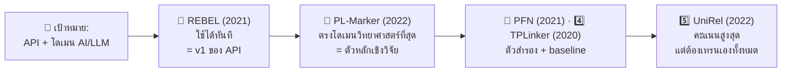

# รายงาน: การคัดเลือกโมเดลสกัดไตรภาค (Relational Triple Extraction) เพื่อ Implement เป็น API Function

> **บริบทของการคัดเลือก**
> - งานวิจัย**ภาษาอังกฤษ** หัวข้อด้าน**เทคโนโลยี / AI / LLM เชิงเทคนิค**
> - ต้องการ implement เป็น **API function** (ใช้งานจริง ไม่ใช่แค่ทดลองบนกระดาษ)
> - อ้างอิงข้อมูลคะแนนจาก `docs/report_triple_extraction_models.md`

---

## 1. ข้อควรพิจารณาก่อนจัดอันดับ

### 1.1 โดเมนของงานใกล้เคียง SciERC มากกว่า NYT/WebNLG

ข้อความเชิงเทคนิค/AI/LLM เป็น "ข้อความวิทยาศาสตร์" ไม่ใช่ข้อความทั่วไป — รายงานหลักชี้ชัดว่าโมเดลที่ทำ F1 ได้ ~94% บน NYT/WebNLG จะเหลือเพียง **39–53%** บน SciERC เพราะ:

- ศัพท์เฉพาะทางเยอะ (self-attention, retrieval-augmented generation, KV cache ฯลฯ)
- **Nested Entities** พบมาก (เช่น "attention" ซ้อนใน "self-attention mechanism")
- ชุด relation ของ benchmark ทั่วไปไม่ตรงกับ relation ฝั่งเทคนิค

ดังนั้น **F1 สูงสุดบนกระดาษ ≠ ใช้ได้จริงกับงานเรา** ต้องถ่วงน้ำหนักเรื่องโดเมนและความพร้อมใช้งาน

### 1.2 มิติ "ปีที่ออก" ของ lib/โมเดล

ปีที่ออกสะท้อน 3 อย่างที่สำคัญต่อการเลือกใช้จริง:

| ปีที่ออก | สิ่งที่บอกเรา |
|---|---|
| **เก่า (2020–2021)** | โค้ด mature, มีคนใช้เยอะ, เจอ bug น้อยลง, ติดตั้งง่าย, มี reference ให้ค้นเยอะ — แต่แนวคิดเก่ากว่า คะแนนต่ำกว่าเพื่อนรุ่นใหม่ |
| **ใหม่ (2022–2023)** | คะแนนสูงกว่า แนวคิดทันสมัยกว่า — แต่โค้ดมัก research-grade, weight ไม่แพร่หลาย, ต้องเทรนเอง, documentation บาง |

สำหรับเป้าหมาย "เป็น API" โมเดล**เก่ากว่าที่มี pretrained weight สำเร็จรูป** มักมีคุณค่าใช้งานสูงกว่าโมเดลใหม่ที่ต้องเทรนเอง — ยกเว้นโมเดลใหม่ที่ตรงโดเมนพอดี

---

## 2. 🏆 อันดับ 1–5 สำหรับบริบทนี้ (พร้อมปีที่ออก)

| อันดับ | โมเดล / lib | ปีที่ออก | คะแนนดีที่สุด | ราคา: ใช้ได้เลยหรือต้องเทรน | เหตุผล |
|---|---|---|---|---|---|
| 🥇 **1** | **REBEL** (`Babelscape/rebel-large`) | **2021** | 93.4% (NYT) | ✅ มี pretrained weight — **infer ได้ทันที** | ตัวเดียวในท็อป 5 ที่ implement เป็น API ได้ในวันเดียวด้วย `transformers` ปี 2021 แปลว่า ecosystem mature (HuggingFace, doc เยอะ, bug ถูกเจ็บมาแล้ว) ชุด relation มาจาก Wikipedia ซึ่งมี relation ฝั่ง computing อยู่แล้ว (`developer`, `instance of`, `based on`, `subclass of`) จึงเข้ากับข้อความ AI/LLM ค่อนข้างดี และเป็น generative จึงไม่ต้องออกแบบ relation schema ล่วงหน้า — เหมาะเป็น **v1 ของ API และ baseline ทางวิชาการ** |
| 🥈 **2** | **PL-Marker** | **2022** | **53.2% (SciERC)** — แชมป์โดเมนวิทยาศาสตร์ | ⚠️ ต้อง fine-tune เอง | ปีใหม่ (2022) + **ตรงโดเมนที่สุด** — span-based จับ Nested Entity ได้ดี ซึ่งเป็นปัญหาหลักของข้อความเทคนิค คะแนน SciERC เหนือกว่าสาย Sequence Labeling ชัดเจน (53.2 เทียบ ~39–50) เหมาะเป็น **v2/ตัวหลักเชิงวิจัย** หลังเก็บ labeled data โดเมน AI ได้แล้ว |
| 🥉 **3** | **PFN** | **2021** | 93.6% (WebNLG) · 92.4% (NYT) | ⚠️ ต้องเทรนเอง | สาย span-based เหมือน PL-Marker คะแนน**สม่ำเสมอทั้ง 2 ชุด** สถาปัตยกรรม partition filter แยก representation เอนทิตี/ความสัมพันธ์ชัดเจน — ตัวสำรองถ้า PL-Marker fine-tune แล้วยังไม่ดี แต่ไม่ตรงโดเมนเท่า (คะแนน SciERC ไม่โดดเด่น) |
| 4️⃣ **4** | **TPLinker** | **2020** | 91.9% (NYT/WebNLG) | ✅ โค้ดเปิด มั่นคง — เทรน/infer ได้ | ปีเก่าสุดในลิสต์ (2020) ซึ่งแลกมาด้วย **ความ mature สูงสุด** คะแนนต่ำกว่าท็อปนิดเดียว แต่ single-stage ไม่มี Exposure Bias และเป็น **baseline เทียบเชิงวิชาการที่ดีที่สุด** — ถ้าเป้าหมายมีการเขียน report/ตีพิมพ์ ควรมีตัวนี้ในตารางเปรียบเทียบ |
| 5️⃣ **5** | **UniRel** | **2022** | **94.7% (WebNLG)** — สูงสุดในรายงาน | ❌ โค้ด/weight แพร่หลายน้อยที่สุด — ต้องเทรนเอง | คะแนนกระดาษสูงสุด แต่สำหรับงานที่ต้องเป็น API จริง ต้นทุนการเทรนเองไม่คุ้มในขั้นแรก — เหมาะเป็น phase หลัง ถ้าต้องการผลั้งคะแนนสูงสุดเพื่อลง paper |

### ทำไมจัดอย่างนี้ — สรุปสั้น



**มุมมอง "ปีที่ออก" ที่ควรเห็น:** อันดับ 1 (REBEL, 2021) **ไม่ใช่โมเดลที่ใหม่ที่สุดหรือเก่งที่สุดบนกระดาษ** — แต่เป็นโมเดลที่จุดตัดระหว่าง "คะแนนระดับท็อป" × "mature พอจะเป็น API ได้จริง" ดีที่สุด ส่วนโมเดลปี 2022–2023 ที่คะแนนสูงกว่า (UniRel, ESGM) ล้วนติดที่ "ต้องเทรนเอง + โค้ด research-grade" ซึ่งสำหรับ use case API คือต้นทุนที่แพงกว่าผลตอบแทนที่ได้ ในขณะที่ PL-Marker (2022) ขึ้นมาอันดับ 2 เพราะได้สองอย่างพร้อมกัน — ปีใหม่พอมีแนวคิดทันสมัย และ**คะแนนโดเมนวิทยาศาสตร์ที่ตรงกับงานเราที่สุด**

> **หมายเหตุนอกขอบเขตรายงานหลัก:** repo นี้มีการตั้งค่า **GLiREL/GLiDRE** (zero-shot relation extraction) ไว้แล้วจาก commit ก่อนหน้า — อยู่นอก scope ของรายงานหลัก แต่ต่อ API ง่ายพอ ๆ กับ REBEL น่ารันคู่กันเป็น third opinion

---

## 3. 📏 ควรแบ่งหน่วยประมวลผลระดับไหน: ประโยค / paragraph / ทั้งเอกสาร?

**ข้อสรุป: ใช้ sentence-level เป็นหน่วยหลัก (primary unit)**

### เหตุผล 4 ข้อ

1. **โมเดลในรายงานทั้งหมดถูกเทรนระดับประโยค** — ชุดข้อมูล NYT/WebNLG/SciERC เป็น annotated ระดับประโยค การยัด paragraph ยาว ๆ ทำให้โมเดลทำงานนอก distribution และ recall ตกหนัก
2. **ข้อเท็จจริงทางเทคนิคส่วนใหญ่อยู่ระดับประโยค** — "LLaMA was trained on 1.4T tokens" / "RAG reduces hallucination by grounding retrieval" เป็นประโยค self-contained เกือบทั้งหมด
3. **รายงานหลักเตือนไว้ตรงนี้พอดี** — ถ้าไม่กรองประโยคที่ไม่มีไตรภาค คะแนนของ CasRel/TPLinker/PRGC ร่วง 6–15% การแยกประโยคก่อน + กรองประโยคที่ไม่น่ามี relation (เช่น ไม่มี verb แสดงความสัมพันธ์, สั้นเกินไป) คือการจำลองสิ่งที่ benchmark ทำให้โมเดลฟรี — ยัด paragraph ทั้งก้อนจะกลายเป็นการปล่อย noise จำนวนมากเข้าไปลด precision
4. **เหมาะกับ API design** — ประโยคเล็ก batch/parallel ได้, latency คาดเดาได้, และได้ character offset ย้อนกลับไป reference ตำแหน่งในเอกสารต้นทาง (สำคัญถ้าทำ UI แสดง provenance)

### บทบาทของ paragraph และทั้งเอกสาร — ไม่ทิ้ง แต่ใช้คนละชั้น

```
📄 เอกสาร (research paper)
 └─ แบ่งเป็น paragraph → เก็บเป็น context/provenance
     └─ แยกเป็น sentence  → ✅ หน่วยที่ยิงเข้าโมเดล (extraction จริงเกิดที่นี่)
         └─ triples ที่ได้ → merge กลับระดับเอกสาร (dedup, entity normalization)
```

| ระดับ | บทบาท |
|---|---|
| **Sentence** | หน่วย extraction — ตรงกับที่โมเดลถูกเทรนมากที่สุด |
| **Paragraph** | บริบท/provenance — เก็บว่า triple มาจากย่อหน้าไหน, ช่วยตีความ pronoun ในประโยคต่อเนื่อง แต่**ไม่ใช่**หน่วยที่ยิงเข้าโมเดล |
| **Document** | post-processing — dedup triple ซ้ำ, entity normalization (เช่น BERT = Bidirectional Encoder Representations from Transformers), แล้วค่อยรวมเป็น Knowledge Graph |

### ข้อจำกัดที่ต้องรู้: Cross-sentence relation

ประโยคแบบ *"We propose X. **It** outperforms GPT-4."* — เอนทิตีอยู่คนละประโยค การ extract แบบ sentence-level จะหลุด relation นี้ **ทางแก้ (phase หลัง ไม่จำเป็นตั้งแต่ v1):** เติม coreference resolution (เช่น fastcoref) เป็น pre-pass เพื่อแทน pronoun ด้วย entity จริงก่อนยิงเข้าโมเดล

---

## 4. 📌 Roadmap ที่แนะนำ

| Phase | งาน | เครื่องมือ |
|---|---|---|
| **v1 (ตอนนี้)** | API function ที่ใช้ได้จริง + เก็บผลลัพธ์เป็น data สำหรับเทียบเคียง | REBEL (2021) — sentence-level + กรองประโยคก่อน |
| **v2 (หลังมี labeled data โดเมน AI)** | Fine-tune โมเดลเฉพาะโดเมนเป็นตัวหลักเชิงวิจัย | PL-Marker (2022) — fine-tune บนข้อมูล AI/LLM ที่เก็บได้ |
| **เทียบเคียง (ตลอด)** | Baseline เชิงวิชาการ | TPLinker (2020) · GLiREL (ใน repo, zero-shot) |
| **Phase หลัง (ถ้าต้องการคะแนนสูงสุดเพื่อตีพิมพ์)** | เทรนโมเดลท็อปกระดาษ | UniRel (2022) หรือ ESGM (2023) |
