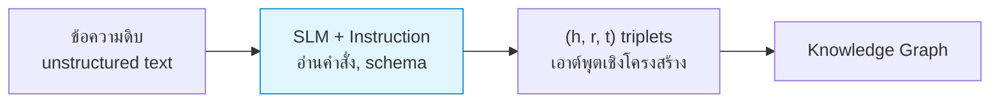
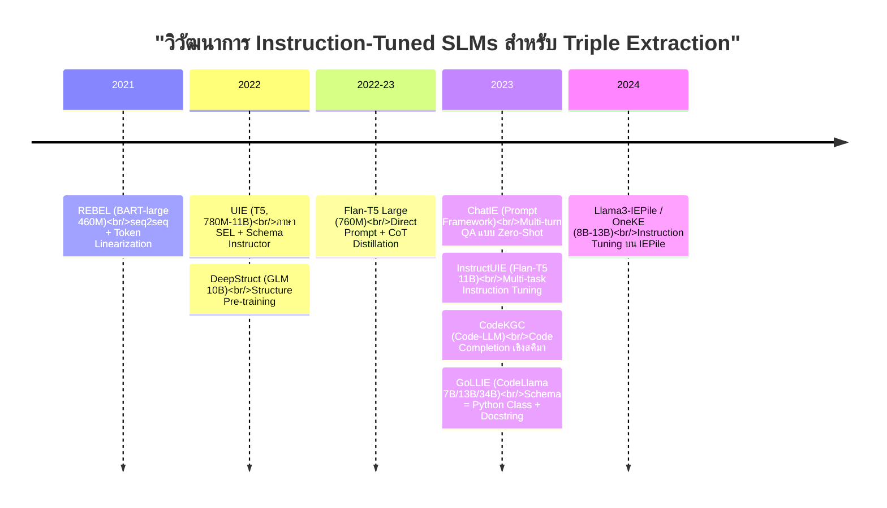
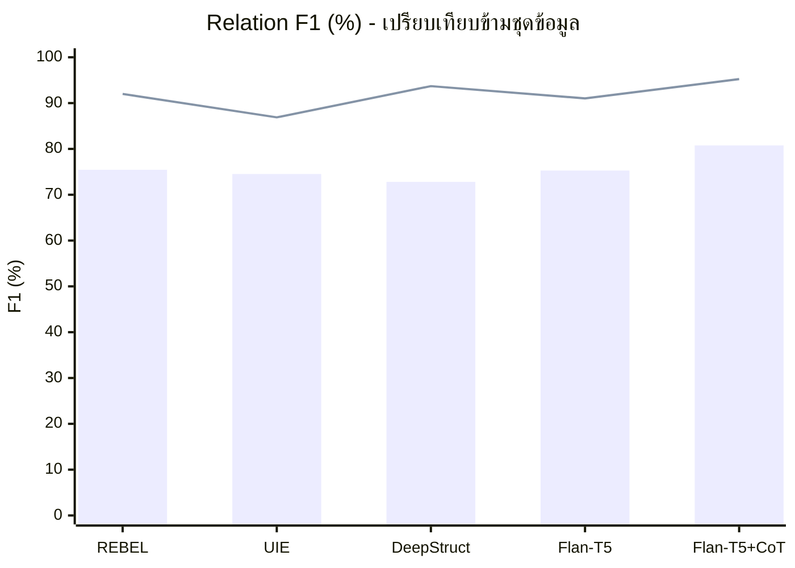
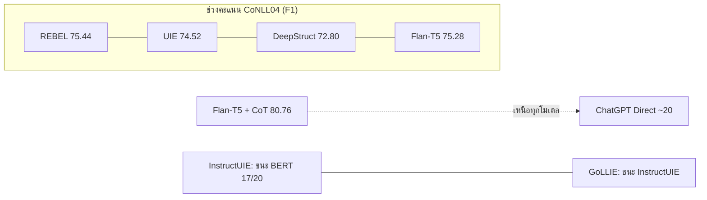
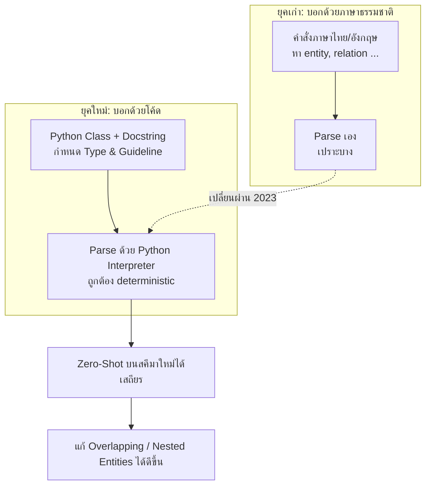
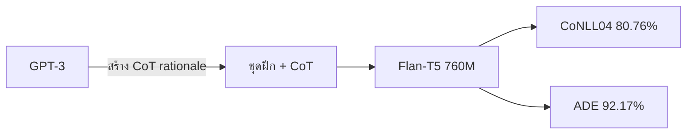
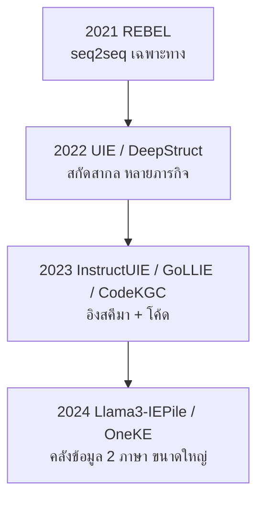
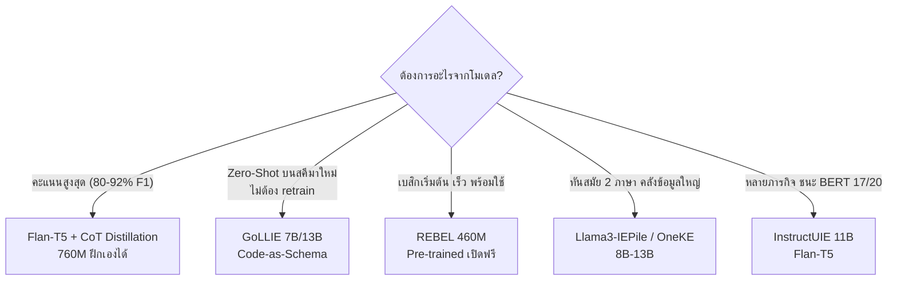

# รายงาน: โมเดล Instruction-Tuned SLMs สำหรับ Triple Extraction

> เป้าหมายของรายงานนี้คือ อธิบายให้เข้าใจง่ายที่สุด ว่าโมเดลภาษาขนาดเล็ก (SLMs) ที่ถูกปรับแต่งด้วยคำสั่งสอน (Instruction Tuning) ช่วยสกัดข้อมูลสามส่วน `(Head, Relation, Tail)` ได้อย่างไร
> ทุกส่วนมีแผนภาพ Mermaid ประกอบ พร้อมคำแนะนำโมเดลสำหรับการทดลอง 5 อันดับท้ายรายงาน

---

## 1. เกริ่นนำ: Triple Extraction คืออะไร และทำไมต้องใช้ SLMs?

**Triple Extraction** คือการแปลงข้อความธรรมดาให้เป็นข้อมูลสามส่วน `(h, r, t)` ประกอบด้วย เอนทิตีหัว (Head), ความสัมพันธ์ (Relation) และเอนทิตีท้าย (Tail) เช่น

> "บริษัท A ผลิตยา B ซึ่งใช้รักษาโรค C"

จะถูกแปลงเป็น `(บริษัท A, ผลิต, ยา B)` และ `(ยา B, รักษา, โรค C)` ซึ่งเป็นวัตถุดิบสำคัญในการสร้าง **Knowledge Graph** (กราฟความรู้)

**วิธีเดิมมีปัญหาอะไร?**

- ใช้โมเดลจำแนกเฉพาะทาง (เช่น BERT ร่วมกับตัวจำแนกความสัมพันธ์) หรือแบ่งเป็นหลายขั้นตอน
- ผลเสียคือ **ข้อผิดพลาดสะสม** (Error Propagation) — พลาดตั้งแต่ขั้นแรก ยิ่งไปต่อยิ่งเพี้ยน
- ยากต่อการนำไปใช้กับโดเมนใหม่แบบ Zero-Shot (ไม่ต้องฝึกใหม่)

**ทางออกของยุคนี้:** หันมาใช้ **SLMs** (Small Language Models — โมเดลเล็ก ราว 400 ล้าน ถึง 1.3 หมื่นล้านพารามิเตอร์) ที่ผ่าน **Instruction Tuning** เปลี่ยนโจทย์เป็น "อ่านคำสั่ง → สร้างข้อความตามโครงสร้างที่กำหนด" ทำได้ในขั้นตอนเดียว (End-to-End) ใช้ทรัพยากรน้อย แต่แม่นยำสูง

---

## 2. วิวัฒนาการของโมเดล (Timeline)

โมเดลแต่ละยุคเกิดมาเพื่อแก้จุดอ่อนของยุคก่อนหน้า ไล่เรียงได้ดังนี้

**อ่านแบบง่าย ๆ:**

| ยุค | จุดเปลี่ยนสำคัญ |
|---|---|
| **2021** | เริ่มใช้วิธี seq2seq (REBEL) — สกัดเป็นข้อความเดียวจบ |
| **2022** | โมเดลใหญ่ขึ้นและอเนกประสงค์ขึ้น (UIE, DeepStruct) |
| **2023** | เปลี่ยนแนวคิดครั้งใหญ่ — ใช้**โค้ด**แทนภาษาธรรมชาติ (GoLLIE, CodeKGC) + ใช้ ChatGPT มาช่วยสร้างข้อมูลสอน (ChatIE, CoT) |
| **2024** | รวมคลังข้อมูลขนาดใหญ่ถึง 2 ภาษา (IEPile, OneKE) |

---

## 3. เปรียบเทียบโมเดลแบบภาพรวม

| โมเดล | ปี | โมเดลต้นทาง | ขนาดพารามิเตอร์ | รูปแบบเอาต์พุต |
|---|---|---|---|---|
| REBEL | 2021 | BART-large | 460M | สร้างข้อความแบบ seq2seq (Token Linearization) |
| UIE | 2022 | T5-v1.1 / Struct-T5 | 780M–11B | Structured Extraction Language (SEL) |
| DeepStruct | 2022 | GLM | 10B | สร้างสามส่วนแบบมีโครงสร้าง |
| Flan-T5 (Baseline) | 2022/23 | Flan-T5 Large | 760M | Prompt ตรง ๆ / แบบ CoT |
| ChatIE | 2023 | ChatGPT (API) | — | ถาม-ตอบหลายรอบ (Multi-turn QA) |
| InstructUIE | 2023 | Flan-T5 | 11B | จำกัดตัวเลือกความสัมพันธ์ด้วยภาษาธรรมชาติ |
| CodeKGC | 2023 | Code-Davinci / Code-LLM | — | เติมโค้ดให้สมบูรณ์โดยมีเหตุผลประกอบ |
| GoLLIE | 2023 | CodeLlama | 7B / 13B / 34B | Python Class + Docstring เป็นแนวทางกำกับ |
| Llama3-IEPile / OneKE | 2024 | LLaMA-3 / Baichuan2 | 8B–13B | ฝึกบนสคีมาแบบมีเงื่อนไข (Schema-Conditioned) |

---

## 4. คะแนนประสิทธิภาพ (F1 Score)

> **ตัวชี้วัดสำคัญ:** Strict Relation F1 — คำตอบจะถือว่าถูกต้อง **ต้องได้ทั้ง Head, Tail และ Relation ถูกต้องครบพร้อมกัน** ไม่ใช่แค่เดาความสัมพันธ์ถูก

### 4.1 แผนภูมิเปรียบเทียบคะแนน

*อ่านแผนภูมิ: `bar` คือคะแนนบนชุดข้อมูล CoNLL04, `line` คือคะแนนบนชุดข้อมูล NYT — สังเกตว่า **Flan-T5 + CoT** ทำได้สูงสุดทั้งสองชุด*

### 4.2 ตารางคะแนนเต็ม

| โมเดล | CoNLL04 | NYT | ADE | เงื่อนไขการประเมิน |
|---|---|---|---|---|
| REBEL | 75.44 | 92.00 | 82.21 | Fine-tune แบบมี label เต็มรูปแบบ |
| UIE (T5-Large) | 74.52 | 86.89* | — | Fine-tune แบบมี label เต็มรูปแบบ |
| DeepStruct (10B) | 72.80 | 93.70 | 83.60 | ฝึกหลายภารกิจพร้อมกัน |
| Flan-T5 Large (760M) | 75.28 | 91.03 | 83.15 | Fine-tune แบบมี label เต็มรูปแบบ |
| **Flan-T5 + GPT-3 CoT** | **80.76** | **95.23** | **92.17** | กลั่น CoT + Fine-tune |
| InstructUIE (11B) | ชนะ BERT 17/20 ภารกิจ | — | — | Zero-Shot และแบบมี label |
| GoLLIE (7B/13B) | เหนือกว่า InstructUIE | — | — | Zero-Shot ตามแนวทางกำกับ |
| CodeKGC | **ได้คะแนน +17.40 F1** เหนือ baseline | — | — | Zero-Shot เทียบกับ Prompt ทั่วไป |
| ChatGPT (Direct Zero-Shot) | ~20.00 | 3.45 | 19.47* | Zero-Shot prompt ตรง ๆ |
| ChatGPT + SUMASK | ชนะโมเดลที่ฝึกแล้ว | — | เหนือ SOTA +2.8% | Zero-Shot แบบ Prompt ขั้นสูง |

\* แถว UIE คอลัมน์ NYT เป็นคะแนน Entity F1 / แถว ChatGPT คอลัมน์ ADE เป็นคะแนน TACRED

### 4.3 มุมมองเชิงเปรียบเทียบแบบเห็นภาพ

---

## 5. ข้อค้นพบสำคัญ 3 ประการ

### 5.1 โมเดลใหญ่ไม่ได้แปลว่าดีกว่า — ช่องว่างเชิงพารามิเตอร์

**สิ่งที่ค้นพบน่าประหลาดใจ:** GPT-3.5 ซึ่งมีพารามิเตอร์ถึง 1.75 แสนล้าน กลับได้คะแนนต่ำมากเมื่อถูกถามแบบ Zero-Shot ตรง ๆ (CoNLL04 ~20%, NYT 3.45%, TACRED 19.47%) ขณะที่ REBEL (460M) หรือ Flan-T5 (760M) ซึ่งเล็กกว่าหลายร้อยเท่า กลับทำได้ **75–95%**

**เพราะอะไร?**

ภารกิจ Triple Extraction ต้องการความแม่นยำด้านโครงสร้างสูงมาก — ต้องได้สามส่วนครบและตรงฟอร์แมต โมเดลใหญ่ทั่วไปชอบ "สร้างข้อความอิสระ" จึงหลุดสคีมาบ่อย ส่วน SLMs ที่ผ่านการฝึกด้วยคำสั่ง จะถูกบีบให้จับขอบเขตเอนทิตีและฟอร์แมตได้แม่นยำกว่า

> **ข้อสรุป:** โมเดลเล็กไม่ใช่ข้อเสีย ถ้าได้รับการปรับแต่งมาอย่างดี กลับประหยัดทรัพยากรกว่าและเอาต์พุตคงเส้นคงวากว่า

### 5.2 เปลี่ยนจาก "บอกเป็นภาษา" มาเป็น "บอกเป็นโค้ด" (Code-as-Schema)

ตั้งแต่ปี 2023 มีการเปลี่ยนแนวคิดครั้งใหญ่ — จากเดิมป้อนสคีมา (schema) เป็นภาษาธรรมชาติ (แบบ InstructUIE) มาเป็น **ภาษาโค้ด Python** แทน (แบบ GoLLIE, CodeKGC)

**ทำไมวิธีนี้ดีกว่า?**

1. **ใช้จุดแข็งของโมเดลที่ฝึกมาด้วยโค้ด** — โมเดลเหล่านี้เข้าใจเรื่องชนิดข้อมูล (Type), ลำดับชั้น และตรรกะเชิงโครงสร้างได้ดีกว่าภาษาธรรมชาติ จึงจัดการปัญหาเอนทิตีซ้อนทับ (Overlapping) และเอนทิตีซ้อนกัน (Nested) ได้ดี
2. **ตรวจสอบผลลัพธ์ได้ทันที** — เอาต์พุตที่เป็นโค้ดสามารถนำไปรันผ่าน Python interpreter เพื่อตรวจความถูกต้องของ syntax ได้ทันที ทำให้การสกัดแบบ Zero-Shot บนสคีมาใหม่มีความเสถียรสูง

### 5.3 การกลั่น CoT จากโมเดลใหญ่ + คลังข้อมูลขนาดใหญ่ = ตัวช่วยสำคัญ

**การทดลองบน Flan-T5 ให้บทเรียนที่น่าสนใจ:**

- ฝึกด้วยข้อมูล Triple Extraction ธรรมดา → ได้ 75.28% (CoNLL04)
- เพิ่มขั้นตอน **Chain-of-Thought (CoT)** — สอนให้โมเดลให้เหตุผลทีละขั้นก่อนตอบ เช่น "เพราะเหตุผลนี้ จึงจับคู่เอนทิตีคู่นี้" — แล้วค่อยสร้างสามส่วน
- ผลลัพธ์: CoNLL04 พุ่งเป็น **80.76%**, ADE พุ่งเป็น **92.17%**

**บทเรียน:** อย่าแค่ฝึกให้โมเดล "ตอบ" — ควรฝึกให้โมเดล "คิดก่อนตอบ" ผลลัพธ์ดีขึ้นชัดเจน

นอกจากนี้ คลังข้อมูลคำสั่งขนาดใหญ่ในปัจจุบัน เช่น **IEPile** (33 ชุดข้อมูล) และ **InstructIE** (123 ประเภทความสัมพันธ์) ร่วมกับเทคนิคแบ่งสคีมาเป็นชิ้นส่วน (Chunked Instruction) กำลังกลายเป็นโครงสร้างพื้นฐานสำคัญ ที่ช่วยลดปัญหาการสับสนเมื่อโมเดลต้องจัดการความสัมพันธ์หลายประเภทพร้อมกัน

---

## 6. สรุปภาพรวม

**เส้นทางของวงการ:** จากโมเดลเฉพาะทางขนาดเล็ก (REBEL) → โมเดลสกัดสากล (UIE, DeepStruct) → โมเดลที่อิงสคีมาและโค้ด (InstructUIE, GoLLIE, CodeKGC) → โมเดลที่ฝึกบนคลังข้อมูลมหาศาล (Llama3-IEPile, OneKE)

**สำหรับคนที่ทำงานจริง:** หากต้องการสร้างกราฟความรู้ในสภาพแวดล้อมทรัพยากรจำกัด งานวิจัยยืนยันตรงกันว่า **SLMs ขนาด 7B–13B ที่ผ่าน Instruction Tuning** ให้คะแนน F1 สูงกว่าและเอาต์พุตคงเส้นคงวากว่า **LLM ขนาดใหญ่ที่ถามแบบ Zero-Shot ตรง ๆ** อย่างมีนัยสำคัญ

---

## 7. คำแนะนำ: ควรเลือกโมเดลไหนมาทดลอง? (5 อันดับ)

> พิจารณาจากสองปัจจัยหลัก: **คะแนนที่โมเดลทำได้จริง** + **ความเป็นไปได้ในการลงมือทำจริง**

### 🥇 อันดับ 1: Flan-T5 + GPT-3 CoT Distillation (Flan-T5 Large, 760M)

| เกณฑ์ | คะแนน/รายละเอียด |
|---|---|
| CoNLL04 | **80.76%** (สูงสุดในตาราง) |
| NYT | **95.23%** (สูงสุดในตาราง) |
| ADE | **92.17%** (สูงสุดในตาราง) |
| ขนาด | 760M — ใช้ GPU ตัวเดียวหรือโน้ตบุ๊กได้ |

**ทำไมต้องลองอันนี้ก่อน?** ทำคะแนน **สูงสุดครบทุกชุดข้อมูล** และขนาดเล็กพอที่จะ fine-tune เองได้จริง สูตรสำเร็จก็ชัดเจน: เอา CoT จากโมเดลใหญ่มาสร้างชุดฝึก แล้ว fine-tune โมเดลเล็ก — เหมาะเป็น "เป้าหมายสูงสุด" ของการทดลอง

**ข้อควรระวัง:** ต้องมีขั้นตอนสร้าง CoT (อาจใช้ GPT-3/4 เป็นตัวครู) ซึ่งมีต้นทุนอยู่บ้าง แต่จ่ายครั้งเดียวแล้วใช้ได้ยาว

### 🥈 อันดับ 2: GoLLIE (CodeLlama 7B / 13B)

| เกณฑ์ | คะแนน/รายละเอียด |
|---|---|
| วิธีใช้ | Zero-Shot ตามแนวทางกำกับ (ไม่ต้อง retrain) |
| จุดเด่น | เหนือกว่า InstructUIE และ Entailment-IE |
| สคีมา | Python Class + Docstring — เปลี่ยน schema ได้ทันที |

**ทำไมต้องลอง?** หากโจทย์คือ **อยากลองใช้กับสคีมาใหม่ ๆ โดยไม่ต้องฝึกใหม่** GoLLIE คือคำตอบ เพราะแทนสคีมาด้วยโค้ด แล้วตรวจผลด้วย interpreter ทำให้แม่นยำและเสถียร เหมาะกับการทดลองเร็ว ๆ (แค่เขียน Python class แล้วรัน)

**ข้อควรระวัง:** ขนาด 7B–13B ต้องการทรัพยากรสูงกว่า และถ้าต้องการคะแนนสูงสุดบนชุดข้อมูลมาตรฐาน ยังสู้ Flan-T5 + CoT ไม่ได้

### 🥉 อันดับ 3: REBEL (BART-large, 460M)

| เกณฑ์ | คะแนน/รายละเอียด |
|---|---|
| CoNLL04 | 75.44% |
| NYT | 92.00% |
| ADE | 82.21% |
| ขนาด | 460M — เล็กสุด เปิดใช้ได้ทันที |

**ทำไมต้องลอง?** เป็น **จุดเริ่มต้นที่ดีที่สุด** — มี checkpoint สำเร็จรูปให้โหลดใช้บน HuggingFace ทันที คะแนนครบทุกชุดข้อมูล และเบาที่สุด เหมาะใช้เป็น **โมเดลอ้างอิง (Baseline)** เพื่อวัดว่าวิธีอื่นดีกว่าเดิมแค่ไหน ก่อนขยับไปอันดับ 1

**ข้อควรระวัง:** เป็นการฝึกแบบมี label (Fully Supervised) — ถ้าอยากใช้กับโดเมนหรือสคีมาใหม่ ต้องมีข้อมูลสำหรับฝึกก่อน

### 🏅 อันดับ 4: Llama3-IEPile / OneKE (8B–13B)

| เกณฑ์ | รายละเอียด |
|---|---|
| ปี / โมเดลต้นทาง | 2024, LLaMA-3-8B-Instruct / Baichuan2-13B-Chat |
| การฝึก | Instruction Tuning บน IEPile (33 ชุดข้อมูล) + InstructIE (123 ความสัมพันธ์) |
| ภาษา | อังกฤษ–จีน (2 ภาษา) |
| จุดเด่น | SOTA ยุค 2024, เน้นสคีมาที่ซับซ้อน, เปิดเป็นโอเพนซอร์ส |

**ทำไมต้องลอง?** เป็นตัวแทนของเทรนด์ล่าสุดในกลุ่มนี้ — ฝึกบนคลังข้อมูลมหาศาลถึง 2 ภาษา ครอบคลุมความสัมพันธ์กว่า 100 ประเภท จึงเหมาะกับงานที่สคีมาซับซ้อน และเป็นโอเพนซอร์ส ดาวน์โหลดมาใช้เองได้จริง

**ข้อควรระวัง:** ขนาด 8B–13B ต้องการ GPU ที่มีหน่วยความจำพอสมควร และต้องจัดการขั้นตอนโหลด/รันโมเดลเอง (ยังไม่มี checkpoint สำเร็จรูปให้รันทันทีเหมือน REBEL)

### 🏅 อันดับ 5: InstructUIE (Flan-T5, 11B)

| เกณฑ์ | รายละเอียด |
|---|---|
| ปี / โมเดลต้นทาง | 2023, Flan-T5 11B |
| การฝึก | Multi-task Instruction Tuning บนชุดข้อมูล IE ถึง 32 ชุด |
| ผลลัพธ์ | ชนะ BERT 17/20 ภารกิจ, เหนือกว่า GPT-3.5 ชัดเจน |
| เงื่อนไข | รองรับทั้ง Zero-Shot และแบบมี label |

**ทำไมต้องลอง?** เป็นโมเดล "นักสกัดอเนกประสงค์" — ฝึกครั้งเดียวแต่ครอบคลุมหลายภารกิจ รองรับได้ทั้ง Zero-Shot และแบบมี label ผลลัพธ์เหนือกว่าโมเดลเฉพาะทางอย่าง BERT เกือบทุกภารกิจ และเหนือกว่า GPT-3.5 อย่างชัดเจน เหมาะถ้าอยากได้โมเดลที่ใช้ได้กว้าง ๆ ไม่จำกัดแค่การสกัดความสัมพันธ์

**ข้อควรระวัง:** ผลลัพธ์เป็นแบบเปรียบเทียบ (ไม่มีค่า F1 ตัวเลขตรงในตาราง) จึงเหมาะใช้ดูแนวโน้มความสามารถมากกว่าวัดคะแนนชัด ๆ และขนาด 11B ต้องการทรัพยากรสูง

### สรุปการตัดสินใจในตารางเดียว

| ลำดับ | โมเดล | เลือกเมื่อ | ไม่เหมาะเมื่อ |
|---|---|---|---|
| 🥇 | Flan-T5 + CoT | อยากได้คะแนนสูงสุด, มีงบ fine-tune และสร้าง CoT | ไม่มีชุดข้อมูลหรืองบประมาณสำหรับ train |
| 🥈 | GoLLIE | อยาก Zero-Shot ข้ามสคีมาใหม่บ่อย ๆ, เปลี่ยน schema รวดเร็ว | GPU จำกัดมาก (ต้องรัน 7B+), โฟกัสชุดข้อมูลมาตรฐานชุดเดียว |
| 🥉 | REBEL | เริ่มต้นเร็ว, ต้องการ baseline, โมเดลเล็กที่สุด | ต้องใช้กับโดเมนใหม่แบบ Zero-Shot |
| 🏅 | Llama3-IEPile / OneKE | อยากได้โมเดลทันสมัย รองรับหลายภาษา สคีมาซับซ้อน | GPU จำกัด, อยากได้ checkpoint พร้อมรันทันที |
| 🏅 | InstructUIE | อยากได้โมเดลอเนกประสงค์ ครอบคลุมหลายภารกิจ | โฟกัสคะแนนตัวเลขชัดเจนบนชุดมาตรฐาน |

**แผนการลงมือที่แนะนำ:**

1. เริ่มจาก **REBEL** เป็น baseline เพื่อวัดระดับเริ่มต้น
2. ทดลอง **Flan-T5 + CoT** เพื่อดันคะแนนให้สูงที่สุด
3. เสริม **GoLLIE** เฉพาะกรณีที่ต้อง Zero-Shot ข้ามสคีมาใหม่บ่อย ๆ
4. ลอง **Llama3-IEPile / OneKE** เมื่อต้องการโมเดลทันสมัยที่รองรับหลายภาษา
5. ทดสอบ **InstructUIE** เมื่อสนใจโมเดลอเนกประสงค์ที่ครอบคลุมหลายภารกิจ

---
*จัดทำจากข้อมูลงานวิจัย AI/LLM — อ้างอิงจากเอกสารประกอบการวิเคราะห์*
