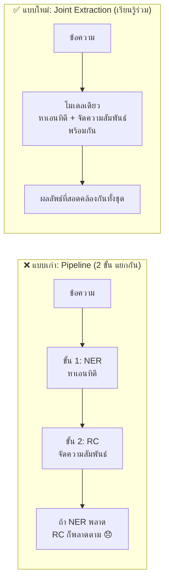
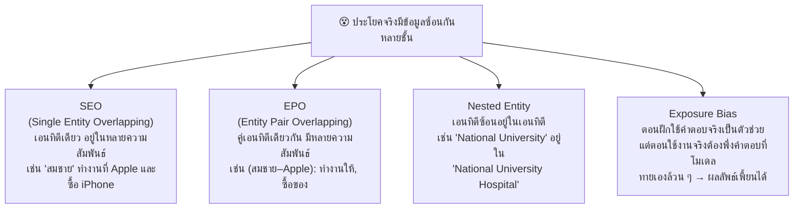
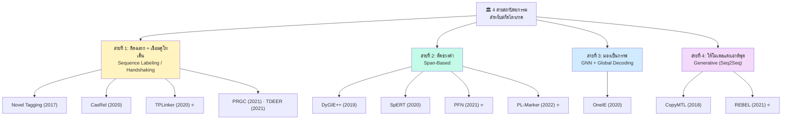
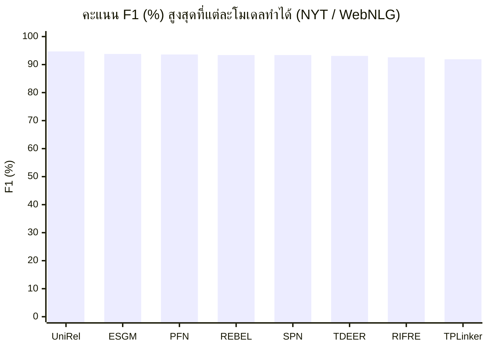
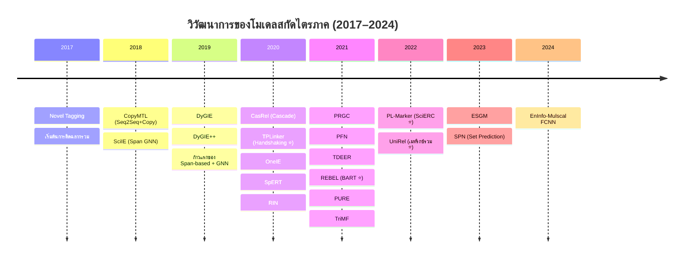
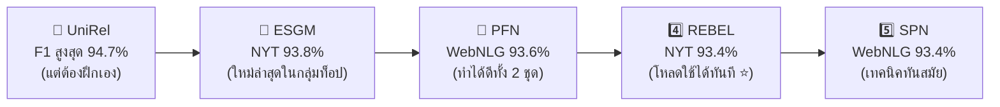
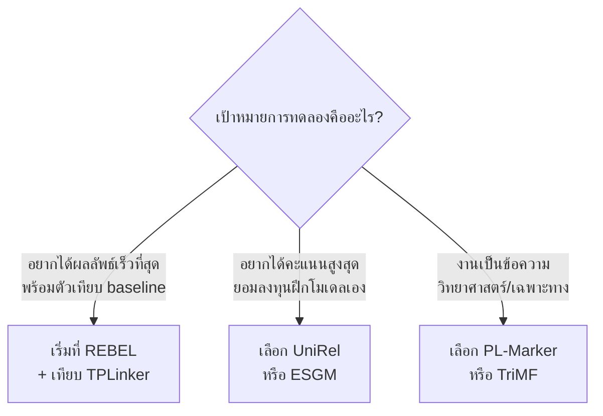

# รายงาน: การสกัดไตรภาคความสัมพันธ์ด้วยโมเดลเฉพาะงาน (Non-Instruction-Tuned SLMs)

> **อ่านเร็วแบบ 1 นาที (TL;DR)**
> - **ไตรภาค** = ความรู้ในรูป `(หัวเรื่อง, ความสัมพันธ์, เป้าหมาย)` เช่น `(Apple, ตั้งอยู่ที่, USA)` ใช้สร้าง Knowledge Graph
> - โมเดลที่พูดถึงในรายงานนี้คือ **โมเดลเฉพาะงาน (Task-specific)** ที่ออกแบบมาเพื่อสกัดไตรภาคโดยตรง **ไม่ใช่** ChatGPT/Llama แบบ "จดคำสั่ง" (Instruction-Tuned)
> - โมเดลที่ดีที่สุดทำ F1 ได้ **~94%** บนชุดข้อมูลทั่วไป (NYT/WebNLG) แต่ทำได้เพียง **~53%** บนข้อความวิทยาศาสตร์ (SciERC) เพราะยากกว่ามาก
> - **Top 5 ที่ควรเลือกมาทดลอง** (ดูหัวข้อสุดท้าย): **UniRel, ESGM, PFN, REBEL, SPN** — แต่ถ้าอยากทดลองจริงจังให้เริ่มที่ **REBEL** ก่อน

---

## 1. ไตรภาคคืออะไร ทำไมต้องสกัด?

การสกัดไตรภาคความสัมพันธ์ (Relational Triple Extraction) คือการอ่านข้อความแบบไม่เป็นระเบียบ แล้วจับออกมาเป็นข้อมูลโครงสร้าง 3 หน่วย:

```
(s, r, o)
├─ s = Subject  → เอนทิตีต้นทาง     เช่น "สมชาย"
├─ r = Relation → ความสัมพันธ์       เช่น "ทำงานที่"
└─ o = Object   → เอนทิตีปลายทาง   เช่น "Apple"
```

ตัวอย่าง: จากประโยค *"สมชายทำงานที่ Apple"* → ควรสกัดได้ไตรภาค `(สมชาย, ทำงานที่, Apple)`

ข้อมูลในรูปนี้คือ**วัตถุดิบหลักในการสร้างกราฟความรู้ (Knowledge Graph)** เช่น กราฟของ Google, ของระบบ QA, ของ recommendation ต่าง ๆ


---

## 2. ทำไมวิธี "แยกขั้นตอน" ถึงไม่พอ → ต้องเป็นโมเดลเรียนรู้ร่วม

วิธีแรก ๆ แบ่งงานเป็น 2 ขั้น (Pipeline) คือ **หาเอนทิตีก่อน (NER)** แล้วค่อย**จัดความสัมพันธ์ทีหลัง (RC)** ปัญหาคือความผิดพลาดจากขั้นแรก**ไหลทบกันไปขั้นที่สอง** เรียกว่า *Error Propagation* ยิ่งข้อความซับซ้อน ยิ่งผิดสะสม



โมเดล Joint ถูกสร้างบนสถาปัตยกรรมหลัก เช่น BERT/SciBERT (Encoder Transformer), LSTM, GNN แต่วิธีแปลงโจทย์ให้เป็นสิ่งที่โมเดล "ทำนายได้" นั้นต่างกัน → กลายเป็น 4 สายสถาปัตยกรรม (ดูหัวข้อ 4)

---

## 3. โจทย์ยาก 3 ข้อที่โมเดลต้องเอาชนะ

ภาษาไทย/อังกฤษจริง ๆ มักมีข้อมูลซ้อนกันหลายชั้น โมเดลที่ดีต้องรับมือได้ 4 สถานการณ์นี้:



| สถานการณ์ | อธิบายแบบง่าย | โมเดลสายไหนแก้ได้ดี |
|---|---|---|
| **SEO / EPO** (Overlapping) | ประโยคเดียวมีไตรภาคหลายชุดที่ทับกัน | TPLinker, UniRel, SPN |
| **Nested Entity** | เอนทิตีเล็กซ้อนในเอนทิตีใหญ่ | สาย Span-based (PL-Marker, TriMF) |
| **Exposure Bias** | ฝึกกับ "ของจริง" แต่ใช้กับ "ของทาย" | สาย Single-stage (TPLinker, SPN, UniRel) |

---

## 4. 4 สายสถาปัตยกรรมหลัก

โมเดลทั้งหมดจัดเป็น 4 กลุ่ม ตามวิธี "มองโจทย์" และ "แปลงโจทย์" ที่ต่างกัน:



### สายที่ 1: ติดฉลาก + เชื่อมคู่โทเค็น (Sequence Labeling & Handshaking)
**หลักคิด:** แปะฉลากให้กับคำ/คู่คำในประโยคว่าเป็นเอนทิตีอะไร อยู่คู่กับอะไร มีความสัมพันธ์แบบไหน

- **Novel Tagging (2017):** ต้นตำรับ — แปะฉลากเดียวครอบ "ตำแหน่ง + ความสัมพันธ์ + บทบาท" แต่จับ Overlapping ไปได้แค่บางกรณี
- **CasRel (2020):** แยกเป็น 2 สเตจ — หา Subject ก่อน แล้วค่อยหา (Relation, Object) ของ Subject นั้น → แก้ SEO/EPO ได้ แต่มี Exposure Bias เพราะสเตจหลังพึ่งพาคำตอบของสเตจแรก
- **TPLinker (2020) ⭐:** ปฏิวัติด้วย "Handshaking Tagging" — ทำนาย**คู่โทเค็น**บนเมทริกซ์ 2 มิติ (ชี้จุดเริ่ม-จุดจบของคู่เอนทิตี + ประเภทความสัมพันธ์) แบบสเตจเดียว → แก้ Exposure Bias ได้ทั้ง 100%

### สายที่ 2: ตัดช่วงคำ (Span-Based)
**หลักคิด:** ใช้ **ช่วงคำ (Span)** แทนการแปะฉลากทีละคำ ทำให้จับเอนทิตีซ้อน (Nested) ได้ดี

- **DyGIE++ (2019):** ใช้ GNN ส่งข้อมูลระหว่างช่วงคำทั่วทั้งเอกสาร
- **SpERT (2020):** ประมวลผลคู่ช่วงคำทั้งหมดโดยตรงด้วย Transformer
- **PFN (2021) ⭐:** แยกพื้นที่การแทนค่าของเอนทิตีกับความสัมพันธ์ออกจากกันชัดเจน ด้วยกลไกกรองข้อมูล
- **PL-Marker (2022) ⭐:** ฝัง "Marker" ในช่วงคำ เพื่อดึงบริบทบริสุทธิ์ของคู่เอนทิตี → **เก่งสุดในสายนี้บน SciERC (53.20%)**

### สายที่ 3: มองเป็นกราฟ (GNN + Global Decoding)
**หลักคิด:** มองทั้งประโยคเป็นกราฟ แล้วเลือก "เครือข่ายสารสนเทศที่ดีที่สุดระดับโลก" ออกมา

- **OneIE (2020):** ใช้ BERT เป็น Encoder → จัดประเภทเอนทิตี/ความสัมพันธ์ระดับท้องถิ่น → ใช้การค้นหาแบบ Global เพื่อให้ได้ผลลัพธ์ที่สอดคล้องกันทั้งชุด

### สายที่ 4: ให้โมเดลแต่งเอาต์พุต (Generative / Seq2Seq)
**หลักคิด:** ไม่ต้องออกแบบฉลากเลย — ฝึกโมเดลให้**แปลงข้อความเข้า → ส่งออกเป็นสตริงโครงสร้างไตรภาค** โดยใช้กลไก "สำเนาคำจากต้นฉบับ" (Copy Mechanism)

- **CopyMTL (2018):** Seq2Seq + Pointer Network คัดลอกดรรชนีคำต้นทางออกมาทีละตัว
- **REBEL (2021) ⭐:** ใช้ **BART** (Autoregressive PLM) ฝึกให้แปลงข้อความธรรมชาติ → สตริงไตรภาคโดยตรง **ไม่ต้องใช้ Prompt / Instruction Tuning** และมี weight สำเร็จรูปให้โหลดใช้ได้ทันที

---

## 5. ตารางเปรียบเทียบประสิทธิภาพ (F1-Score)

ค่าที่นิยมวัดคือ **F1** = ความสมดุลระหว่าง Precision (แม่นไหม) และ Recall (เจอครบไหม) บนชุดข้อมูลมาตรฐาน:
- **NYT, WebNLG** → ข้อความทั่วไป
- **SciERC** → ข้อความวิทยาศาสตร์ (ยากกว่า)
- **ACE2005** → ข่าวสาร/ข้อมูลทั่วไป

| โมเดล | ปี | สายสถาปัตยกรรม | ชุดข้อมูล | คะแนน F1 (%) |
|---|---|---|---|---|
| Novel Tagging | 2017 | Sequence Labeling | NYT | จำกัดในกรณี EPO (จุดเริ่ม) |
| CopyMTL | 2018 | Seq2Seq + Copy | NYT / WebNLG | ดีขึ้นในกรณีหลายไตรภาค |
| SciIE | 2018 | GNN Span-based | SciERC | 39.30 |
| DyGIE | 2019 | GNN + PLM Span | SciERC | 41.60 |
| DyGIE++ | 2019 | Span GNN + BERT | SciERC / ACE2005-Entity | 48.40 / 90.70 |
| CasRel | 2020 | Cascade Binary Tagging | NYT / WebNLG | 89.30 / 89.50 |
| **TPLinker** | 2020 | Handshaking Token-Pair | NYT / WebNLG | **91.90 / 91.90** |
| OneIE | 2020 | Global Graph Decoding | ACE2005-Entity / Relation | 90.30 / 67.50–78.60 |
| SpERT | 2020 | Span Transformer | SciERC | 50.84 |
| RIN | 2020 | RNN Pipeline | NYT / WebNLG | 87.80 / 90.10 |
| PRGC | 2021 | Potential Relation + Global Matrix | NYT / WebNLG | 91.50 / 93.00 |
| **PFN** | 2021 | Span Partition Filter | NYT / WebNLG | **92.40 / 93.60** |
| **TDEER** | 2021 | CNN/RNN Sequence Labeling | NYT / WebNLG | **92.50 / 93.10** |
| RIFRE | 2021 | Relation-Oriented Fusion | NYT / WebNLG | 92.00 / 92.60 |
| CGT | 2021 | PLM Sequence Labeling | WebNLG | 83.40 |
| PURE | 2021 | Pipeline Span PLM | SciERC | 50.10 |
| SpERT.PL | 2021 | Span Attention | SciERC | 51.25 |
| TriMF | 2021 | Multi-Feature Span PLM | SciERC | 52.44 |
| **REBEL** | 2021 | Autoregressive Seq2Seq (BART) | NYT | **93.40** |
| **PL-Marker** | 2022 | Packed Marker Span | SciERC | **53.20** |
| **UniRel** | 2022 | Unified Relational Matrix | NYT / WebNLG | **93.70 / 94.70** |
| ESGM | 2023 | Span + Gate Mechanism | NYT / WebNLG | **93.80** / 92.60 |
| **SPN** | 2023 | Set Prediction Network | NYT / WebNLG | **92.50 / 93.40** |
| EnInfo-Mulscal FCNN | 2024 | Multi-Scale Fusion CNN | NYT-star | Prec 87.20 / Recall 75.10 |

> หมายเหตุ: บางช่องเป็นช่วง เพราะรายงานแต่ละฉบับใช้เงื่อนไขการประเมินต่างกัน (เช่น ตัดหรือไม่ตัดประโยคที่ไม่มีไตรภาคทิ้ง)

---

## 6. ภาพรวมคะแนน + วิวัฒนาการ

### 6.1 คะแนน F1 สูงสุดของแต่ละโมเดลชั้นนำ



### 6.2 ไทม์ไลน์วิวัฒนาการ



### 6.3 ข้อค้นพบเชิงวิเคราะห์ (3 ประเด็นใหญ่)

1. **จากแท็ก 1 มิติ → เมทริกซ์ 2 มิติ**
   โมเดลยุคแรก (Novel Tagging) แท็กทีละคำ จับ Overlapping ไม่ได้เต็มที่ พอ TPLinker และ UniRel ขยับไปทำนาย**ระดับคู่โทเค็น** ก็จับได้ทั้ง SEO และ EPO → UniRel ทำ F1 ได้ 94.70% ซึ่งสูงที่สุดในสายนี้

2. **Single-stage ชนะ Multi-stage ในเรื่องเสถียรภาพ**
   CasRel (2 สเตจ) มี Exposure Bias เพราะสเตจหลังต้องพึ่งคำตอบของสเตจแรก แต่ TPLinker / SPN / UniRel ทำทุกอย่างพร้อมกันทีเดียว → แก้ bias ได้จริง และเสถียรกว่าในประโยคซับซ้อน

3. **โดเมนมีผลมหาศาล + การวัดผลอาจ "โป๊ะ"**
   - ข้อความทั่วไป: โมเดลชั้นนำทำได้ 91–94% แต่ข้อความวิทยาศาสตร์ (SciERC): ได้แค่ **39–53%** เพราะศัพท์เฉพาะ + Nested Entities เยอะ → สาย Span-based (PL-Marker 53.2%, TriMF 52.4%) เหนือกว่าสาย Sequence Labeling อย่างชัดเจนในโดเมนนี้
   - งานวิจัยปี 2023 พบว่า ถ้า**ไม่ตัดประโยคที่ไม่มีไตรภาคทิ้ง** คะแนนของ CasRel/TPLinker/PRGC จะ**ร่วงลง 6–15%** → ในการใช้งานจริงต้องมีระบบคัดกรองประโยคก่อนเสมอ

---

## 7. 🏆 สรุปและคำแนะนำ: ควรเลือกโมเดลตัวไหนมาทดลอง (5 อันดับ)

จัดอันดับโดยอิง **คะแนน F1 เป็นหลัก** แล้วอธิบายปัจจัยอื่น (ความพร้อมใช้งานจริง / จุดแข็งเชิงสถาปัตยกรรม) ประกอบในแต่ละตัว:



### ตารางสรุป 5 อันดับ

| อันดับ | โมเดล | คะแนนดีที่สุด | จุดแข็ง | ข้อควรระวัง |
|---|---|---|---|---|
| 🥇 **1** | **UniRel** (2022) | **94.7%** (WebNLG) · 93.7% (NYT) | F1 สูงสุดในตาราง, Single-stage ไม่มี Exposure Bias, ใช้เมทริกซ์ปฏิสัมพันธ์รวมเอนทิตี+ความสัมพันธ์ | โค้ด/weight ไม่แพร่หลาย → ต้องฝึกเอง อาจใช้เวลานาน |
| 🥈 **2** | **ESGM** (2023) | **93.8%** (NYT) | คะแนน NYT สูงสุด, ใหม่ล่าสุดในกลุ่มท็อป (Span + Gate) | เป็นโมเดลใหม่ งานศึกษายังน้อย, โค้ดเข้าถึงยากพอสมควร |
| 🥉 **3** | **PFN** (2021) | **93.6%** (WebNLG) · 92.4% (NYT) | ทำคะแนนสูง**สม่ำเสมอทั้ง 2 ชุด**, แยกพื้นที่แทนค่าเอนทิตี/ความสัมพันธ์ชัดเจน | ต้องการ GPU พอสมควร เพราะประมวลผลคู่ Span เยอะ |
| 4️⃣ **4** | **REBEL** (2021) | **93.4%** (NYT) | **Practical ที่สุด** — มี pretrained weight (Babelscape/rebel-large) โหลดใช้ได้เลย, เป็น Seq2Seq สาย Generative | ทำนายเป็นลำดับช้ากว่าสายเมทริกซ์นิดหน่อย, ไม่เก่งเรื่อง Nested มากนัก |
| 5️⃣ **5** | **SPN** (2023) | **93.4%** (WebNLG) · 92.5% (NYT) | Transformer Decoder แบบ Non-autoregressive, ทำนายไตรภาคทั้งหมดพร้อมกันเป็น "เซต" | โค้ดยังไม่ mature เท่า TPLinker |

**โมเดลที่ "เกือบติด" น่าจับตาอีก 3 ตัว**
- **TPLinker (91.9%)** — โค้ดเปิดกว้าง มั่นคง ใช้เป็น **baseline เปรียบเทียบ** ได้ดีที่สุด
- **TDEER (93.1%)** — คะแนนดี และเป็น Sequence Labeling ที่เรียบง่าย
- **PL-Marker (53.2%)** — ถ้างานเป็น**ข้อความวิทยาศาสตร์/เฉพาะทาง** ตัวนี้คือแชมป์ของสาย SciERC

### 💡 คำแนะนำสุดท้าย: จะเริ่มตรงไหน?



**บทสรุปแบบกระชับ:**
> เริ่ม **REBEL** ก่อน เพราะคะแนนอยู่ในท็อป (93.4%) และ**ใช้งานจริงได้ทันที** (มี weight สำเร็จรูป) เทียบกับ **TPLinker** เป็น baseline ถ้าเป้าหมายคือ "คะแนนสูงที่สุดในกระดาษ" ค่อยไล่ไป **UniRel (94.7%)** และถ้างานเป็นโดเมนเฉพาะทาง เช่น วิทยาศาสตร์ ให้ข้ามมาที่ **PL-Marker** แทน
